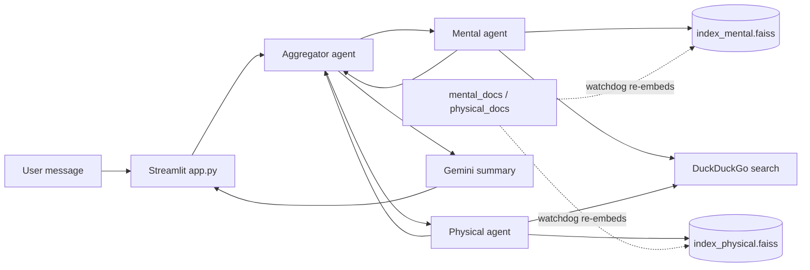

# Rosa: AI-Powered Women's Health Chatbot

A Streamlit chat assistant that combines a mental-health agent and a physical-health agent, both backed by Google Gemini and retrieval over local FAISS indexes, into one supportive reply.

## Overview

Health questions often touch both the body and the mind. Rosa sends each user message to two specialist agents, one for mental health and one for physical health. Each agent pulls context from its own document collection (RAG over FAISS) and from a live DuckDuckGo search. An aggregator agent then combines their answers into one short, conversational response that also takes earlier messages in the session into account.

This was built as an MVP by a three-person team.

> Rosa is a prototype and not a medical device. Its responses are not medical advice.

## Key features

- **Multi-agent design**: separate mental-health and physical-health agents, plus an aggregator that combines their answers into one reply (the prompt asks for 100 words or fewer).
- **Retrieval-augmented generation**: each agent searches its own FAISS vector store built from `mental_docs/` and `physical_docs/`.
- **Live index updates**: a background `watchdog` thread watches the document folders and re-embeds new or changed `.txt` files into the matching index.
- **Web search context**: each agent adds the top DuckDuckGo snippets to its prompt. No API key is needed for this.
- **Session memory**: the conversation history is kept in Streamlit session state and passed to the aggregator.
- **Chat UI**: a Streamlit chat interface with a typing animation and custom styling.

## Tech stack

- Python, Streamlit
- Google Gemini (`google-generativeai`)
- LangChain Community (FAISS vector store, HuggingFace embeddings, text loaders)
- `sentence-transformers/all-MiniLM-L6-v2` embeddings
- FAISS (`faiss-cpu`), `watchdog`, `duckduckgo-search`, `python-dotenv`

## How it works



1. `app.py` starts a background thread (`utils/rag_session_context.start_monitoring`) that builds or loads the FAISS indexes and watches the document folders for changes.
2. When the user sends a message, `aggregate_health_response` sends it to both specialist agents. The query classifier currently always returns `both`.
3. Each agent retrieves the top 5 chunks from its index, adds web search snippets, and asks Gemini for an answer.
4. The aggregator sends both answers and the conversation history to Gemini and returns one combined reply.

## Repository structure

```
.
├── app.py                     # Streamlit UI and chat loop
├── agents/
│   ├── aggregator_agent.py    # Combines the specialist answers
│   ├── mental_agent.py        # Mental-health agent
│   └── physical_agent.py      # Physical-health agent
├── utils/
│   ├── rag_session_context.py # Embeddings, FAISS stores, folder watcher
│   ├── web_search.py          # DuckDuckGo snippet search
│   └── context_loader.py      # Helper to load text files from a folder
├── mental_docs/               # Source documents for the mental index
├── physical_docs/             # Source documents for the physical index
├── index_mental.faiss/        # Prebuilt FAISS index (mental)
├── index_physical.faiss/      # Prebuilt FAISS index (physical)
├── download_model.py          # Saves the embedding model locally
├── requirements.txt
└── .env.example
```

## Getting started

**Prerequisites:** Python 3 and a Google Gemini API key.

```bash
git clone https://github.com/DJCodesStuff/StreamLit_app.git
cd StreamLit_app
python -m venv venv
source venv/bin/activate        # Windows: venv\Scripts\activate
pip install -r requirements.txt
```

Copy `.env.example` to `.env` and fill in the values:

```bash
cp .env.example .env
```

| Variable     | Description                                                   |
|--------------|---------------------------------------------------------------|
| `API_KEY`    | Your Google Gemini API key                                    |
| `MODEL_NAME` | The Gemini model to use. Every agent reads this, but it is not listed in `.env.example`, so add it yourself |

Optional: download the embedding model once so the app can run it from `./models/`. If you skip this step, the app downloads the model from the Hugging Face Hub the first time it runs.

```bash
python download_model.py
```

Run the app:

```bash
streamlit run app.py
```

To add knowledge, put `.txt` files in `mental_docs/` or `physical_docs/`. While the app is running, the watcher re-embeds them into the matching index.

## Author

**Dhruv Joshi**
- GitHub: [DJCodesStuff](https://github.com/DJCodesStuff)
- Portfolio: [djcodesstuff.github.io](https://djcodesstuff.github.io/)
